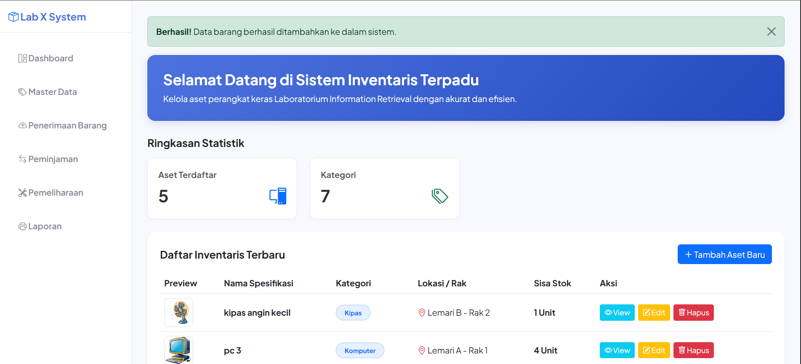
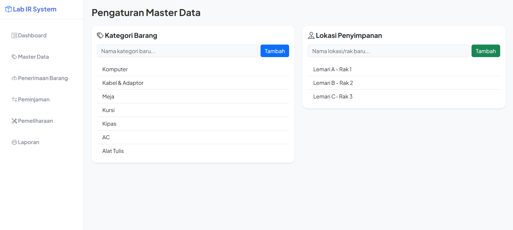
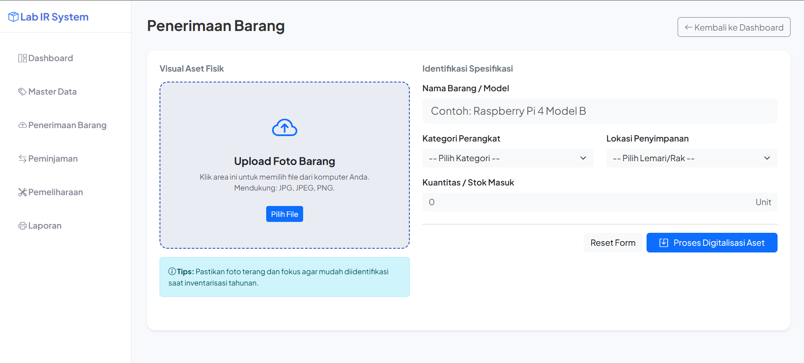
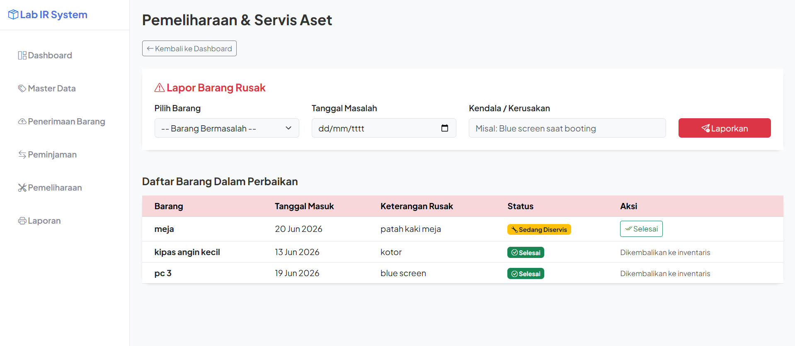
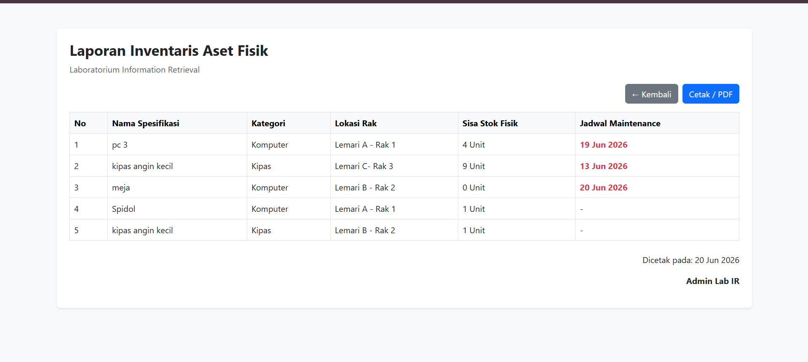
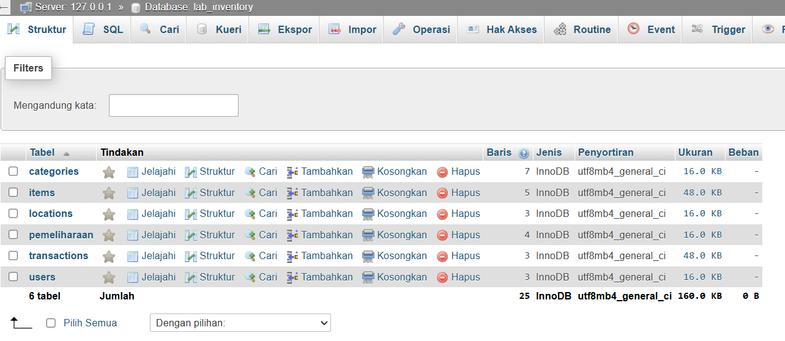

# TesSoftware_Alesandra Firstya Putri
Nama: Alesandra Firstya Putri

NIM: 202431097

Jalur A: Software Development Track

# Sistem Informasi Inventaris Laboratorium
Aplikasi ini adalah sebuah sistem berbasis web (menggunakan PHP dan MySQL) yang dirancang untuk mendigitalisasi dan mempermudah pengelolaan aset fisik di dalam laboratorium. Sistem ini mengubah pencatatan barang yang tadinya manual menjadi otomatis dan terpusat di dalam satu database.

# Problem Solving
Aplikasi ini bertindak sebagai pusat kendali bagi Admin Lab IR dengan fitur-fitur utama meliputi:

- Penerimaan & Manajemen Barang: Fitur untuk mendata barang masuk (seperti PC, kipas angin, meja, kabel), lengkap dengan foto, kategori, dan jumlah sisa stok fisik.
  
- Pelacakan Lokasi Spesifik: Memetakan letak persis setiap aset di laboratorium (contoh: Lemari A - Rak 1, Lemari C - Rak 3) sehingga barang mudah ditemukan.

- Pemeliharaan (Maintenance): Sistem pencatatan khusus untuk melacak barang-barang yang sedang rusak atau dalam masa perbaikan (servis), lengkap dengan tanggal masuk dan keterangan kendala (seperti blue screen).

- Cetak Laporan Otomatis: Fitur untuk menghasilkan laporan inventaris aset fisik secara otomatis (Real-time) yang siap dicetak atau dijadikan PDF, lengkap dengan integrasi jadwal maintenance.

# Fungsi Utama
1. Dashboard

- Pusat Informasi, memberikan gambaran ringkasan data secara real-time.
- Monitoring Data Terkini, menampilkan tabel utama yang berisi daftar barang-barang di laboratorium
- Jalur Pintas, dari tabel yang sama admin bisa langsung mengeksekusi tombol (view, edit, hapus)

2. Master Data

- Kategori Barang, berfungsi untuk mendaftarkan jenis atau kelompok barang baru
- Lokasi Penyimpanan, berfungsi untuk memetakan secara fisik letak barnag-barang di laboratoriium

3. Penerimaan Barang

- Virtual Aset Fisik, area untuk mengunggah (upload) foto asli dari barang yang masuk
- Identifikasi area formulir utama untuk mendata detail barang
- Tombol Eksekusi, tombol pintas untuk reset dan tombol submit untuk menyimpan data yang sudah di input

4. Pemeliharaan

- Form Lapor barang rusak, diisi saat ingin mengajukan maintanance
- Daftar Perbaikan Barang, berfungsi sebagai tabel monitoring khusus untuk barang-barang maintanance

5. Laporan

- Tabel Rekap, merupakan hasil rekapan data yang ada
- Fitur Cetak, berfungsi sebagai tombol print dokumen jika ingin dicetak file hasil rekap nya

6. Database MYSQL

Database terkoneksi dengan phpMyAdmin dengan tabel:
- categories
- items
- locations
- pemeliharaan
- transactions
- users

# Teknologi & Tools
1. Frontend
   - HTML & CSS, kerangka dasar tata letak dan penataan gaya visual halaman web
   - Bootstrap, framework css agar tampilan lebih rapi, modern, dan responsif
   - Bootstrap Icons, kumpulan ikon yang digunakan untuk menambahkan model UI
     
3. Backend
   - PHP, bahasa pemrograman sever-side yang beroperasi di belakang layar
     
5. Database
   - MYSQL, sistem manajemen basis data relasional (RDBMS) yang menampung seluruh data
     
7. Tools
   - XAMPP, perangkat lunak server lokal yang bertindak sebagai mesin utama
   - VSCode, kode editor tempat semua program dijalankan
   - phpMyAdmin, visual bawaaan XAMPP untuk mengelola database MYSQL
     
# Struktur Proyek

- `css/` - Folder untuk menyimpan file desain gaya tambahan (CSS).
-  `uploads/` - Folder direktori penyimpanan file gambar aset yang diunggah.
-  `index.php` - Dashboard utama aplikasi dengan ringkasan statistik.
-  `koneksi.php` - File konfigurasi koneksi ke database MySQL.
-  `master_data.php` - Halaman manajemen Master Data (Kategori & Lokasi).
-  `tambah.php` - Halaman formulir Penerimaan Barang baru.
-  `edit.php` - File proses pembaruan data aset (Update).
-  `hapus.php` - File eksekutor penghapusan data aset (Delete).
-  `pemeliharaan.php` - Halaman manajemen status Pemeliharaan & Servis aset.
-  `laporan.php` - Halaman rekapitulasi Laporan Inventaris siap cetak.
-  `transaksi.php` - Halaman daftar riwayat peminjaman barang.
-  `tambah_transaksi.php` - Halaman pencatatan transaksi peminjaman baru.
-  `kembalikan.php` - File eksekutor pengembalian barang pinjaman ke stok lab.
-  `batal_pinjam.php` - File pembatalan proses transaksi peminjaman.
-  `tambah_user.php` - Halaman pendaftaran akses pengguna/admin baru.

# Cara Menjalankan
1. Buka XAMPP Control Panel lalu nyalakan MYSQL dan Apache
2. Lalu ketik tab baru di browser dengan alamat berikut http://localhost/lab_inventory
   